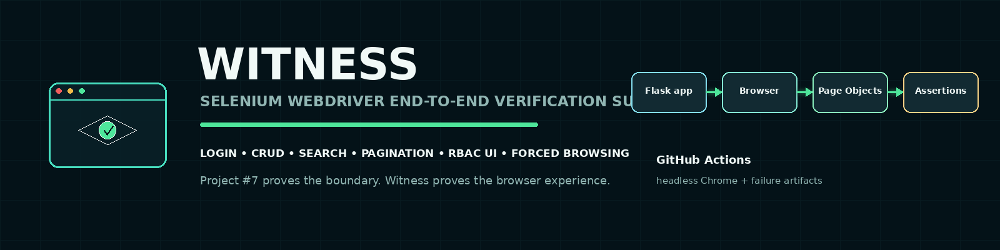
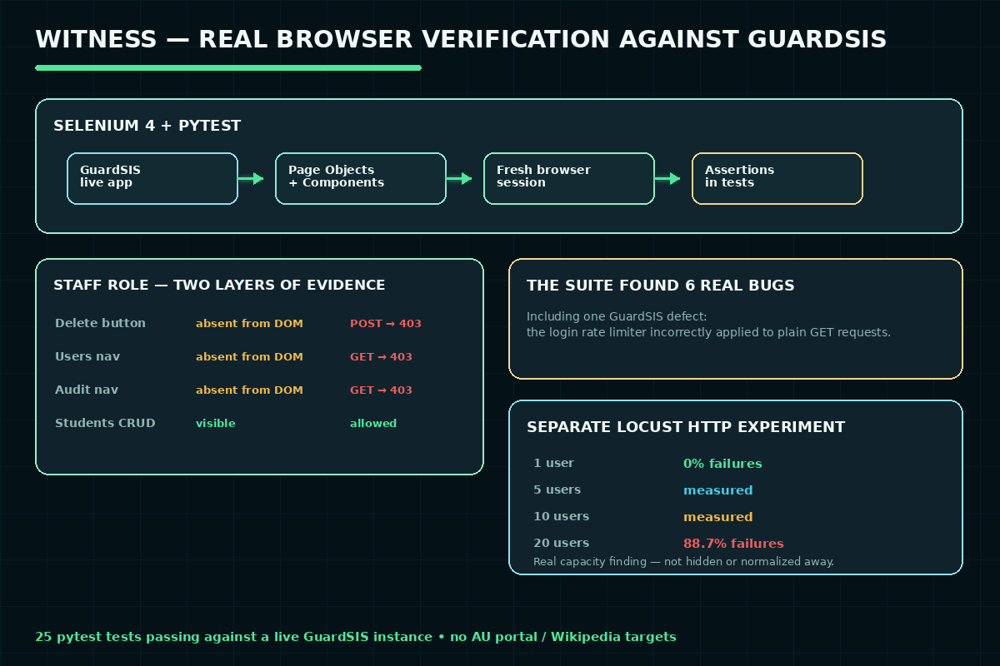

# FlowCheck — Selenium/pytest E2E Suite for GuardSIS




## Course Information

| Field | Details |
|---|---|
| Course | Introduction to Software Engineering (CS112) |
| Semester | Semester 2 — Spring 2024 |
| University | Air University, Islamabad |
| Students | Syed Jazib Ali Rizvi (232145), Hussain Ali (232095), Shehroze Sameer (232091), Qalb e Abbas (232133) |

## Overview

The original coursework is a non-functional (load/stress) testing
exercise using Selenium IDE's record-and-playback tooling against two
live, real, third-party targets: Air University's student-portal login
page and Wikipedia's search engine — with no documented IT authorization
for the former, and no exported test scripts or quantitative results.

**New addition:** [`e2e/`](e2e/), a real, version-controlled Selenium
WebDriver + pytest suite retargeted entirely at a local app this same
effort built (GuardSIS, the GuardSIS) — no
third-party authorization question at all. Covers login, CRUD, search,
pagination, and role-specific UI behavior (Page Object Model, Page
Component Objects, Selenium 4.48's built-in driver management), plus a
separate Locust HTTP-level load experiment. Building it found and fixed
six real bugs — one of them in GuardSIS itself. See
[`e2e/README.md`](e2e/README.md).

## Problem Statement

Demonstrate non-functional (load) testing using Selenium IDE's recording
tools against real, live web applications rather than a local test target.
*(New: and demonstrate it against a target that doesn't raise an
authorization question, with real exported test scripts and real
measured results instead of a qualitative "no problems found.")*

## Objectives

*(original)*
- Record and replay login flows against the AU student portal under load.
- Record and replay search interactions against Wikipedia.
- Report findings and recommendations.

*(this rebuild)*
- Build a real, version-controlled Selenium WebDriver suite against a
  local app, with Page Objects that expose services and tests that own
  the assertions (Selenium's own current guidance).
- Prove GuardSIS's role-based UI both hides forbidden actions from
  Staff *and* that direct URL access to those pages is still rejected
  server-side — hidden UI is not authorization.
- Capture real, reproducible HTTP-level concurrency measurements
  (Locust) instead of a qualitative pass/fail.

## Tools and Technologies

*(original)* Selenium IDE (recording/playback); Selenium WebDriver/Grid
(referenced in the report but not used)

*(this rebuild)* Python 3.12, Selenium 4.48 (Selenium Manager, no
chromedriver checked in), pytest, Locust, Ruff, GitHub Actions

## Features

*(original)* N/A — no custom test scripts were exported/committed;
testing was done via Selenium IDE's point-and-click recorder.

*(this rebuild — see `e2e/README.md` for full detail)*
- A Page Object + Page Component Object suite (`e2e/src/e2e_tests/`)
  covering login/logout, student CRUD, search, pagination, and
  role-specific UI (Staff vs. Admin).
- Forced-browsing / vertical-privilege-escalation tests (OWASP WSTG) —
  confirming a privileged URL is rejected even when the UI never offers it.
- Deterministic E2E database seeding (`seed_e2e.py`, added to GuardSIS)
  instead of using the browser to create prerequisite state.
- Screenshot + page-HTML capture on any test failure.
- A separate Locust load experiment (1/5/10/20 simulated users) with
  real, committed CSV/HTML results.

## Methodology

1. *(original)* Record a login flow against the AU student-portal login page in Selenium IDE.
2. *(original)* Record a search flow against Wikipedia.
3. *(original)* Replay both under load via Selenium IDE.
4. *(original)* Document observations and recommendations in the report.
5. **New:** retarget entirely at GuardSIS, build a real Selenium suite
   against its live app, debug every real failure down to zero (six real
   bugs found and fixed — see `PROJECT_NOTES.md`), and run four real
   Locust load levels for genuine quantitative results.

## How It Works



## Repository Structure

```text
software-testing-with-selenium/
  README.md, PROJECT_NOTES.md, CHANGELOG.md, project.yaml
  e2e/                          NEW: the real Selenium E2E suite
    README.md                  full design writeup and research grounding
    src/e2e_tests/              pages/ (Page Objects), components/ (Page Component Objects)
    tests/                      25 pytest tests, real bugs fixed and documented
    load/locustfile.py          the HTTP-level load experiment
    results/load/               real, committed 1/5/10/20-user CSV/HTML results + SUMMARY.md
    scripts/                    run_e2e.sh, diagnose_pagination.py (real diagnostic evidence)
  docs/software-testing-with-selenium.docx        original, untouched
  presentation/software-testing-with-selenium.pptx   original, untouched
  screenshots/
  .github/workflows/e2e-ci.yml   NEW: Ruff + pytest --collect-only
```

## Setup Instructions

Original: N/A — no test scripts were included with the submission.

New (`e2e/`):

```bash
cd e2e
python -m venv .venv && source .venv/bin/activate   # or .venv\Scripts\activate on Windows
pip install -e ".[dev]"
```

## Usage

Original: N/A.

New:

```bash
cd e2e
# start GuardSIS seeded and running first -- see scripts/run_e2e.sh
BASE_URL=http://127.0.0.1:5050 HEADLESS=1 pytest -q
```

## How to Review

1. Start with this README, then `docs/software-testing-with-selenium.docx` for the original.
2. Review `presentation/software-testing-with-selenium.pptx` (15 slides) for the original summary.
3. **New:** read `e2e/README.md`, then `e2e/src/e2e_tests/components/pagination.py`
   and `e2e/tests/conftest.py` — the two files with the most substantive
   real-bug writeups (a headless-Chrome viewport quirk, and a rate
   -limiting interaction that turned out to be a real bug in GuardSIS).
4. Open `e2e/results/load/SUMMARY.md` for the real Locust findings.

## Screenshots

See `screenshots/` — project description, methodology, Selenium recording/overview/comparison, test-case design/execution, and results slides (original, unchanged).

## Results

**Original:** the report states no problems were identified: the login
flow signed in successfully under the tested load, and Wikipedia's
search engine performed correctly. No quantitative load numbers
(response times, concurrent-user counts) are documented — the findings
are qualitative only.

**New:** all 25 tests pass against a real, live GuardSIS instance
(Chrome 152, Selenium 4.48.0, headless), run repeatedly while debugging
six real bugs down to zero — not asserted from one lucky pass. Ruff
reports zero issues. Four real Locust load levels (1/5/10/20 simulated
users) produced genuine quantitative results, including an honest
capacity finding: GuardSIS's app-wide rate-limit default saturates
almost immediately under real concurrent traffic sharing one IP (0%
failures at 1 user, climbing to 88.7% at 20) — see
`e2e/results/load/SUMMARY.md`.

## Limitations

*(original)*
- No exported/committed test scripts — the Selenium IDE project files were not saved with the submission.
- No quantitative performance data (response times, throughput, concurrency levels) was recorded.

*(this rebuild — see `e2e/README.md` for full detail)*
- No per-test transactional database rollback in GuardSIS — E2E tests
  use unique generated values to stay independent instead.
- Chrome only, no cross-browser matrix.
- CI runs lint + test collection only, not a live E2E run — this suite
  tests a separate, independent repository this workspace deliberately
  doesn't vendor as a git submodule, so CI has no way to check it out.

## Future Enhancements

*(original)*
- Export and version-control the actual Selenium IDE test suites — **done** in this rebuild.
- Capture quantitative load metrics rather than a qualitative pass/fail summary — **done** in this rebuild.

*(this rebuild)*
- A real sibling-repo checkout strategy for CI, if this workspace's
  multi-repo model is ever revisited.
- Firefox/Edge cross-browser execution.

## Safety and Privacy

- No real credentials or portal screenshots are exposed in the original
  material — the checked screenshots show only the generic Selenium IDE
  interface and Wikipedia.
- No student personal data is included beyond the standard group-authorship names below.
- The new `e2e/` suite targets only a local app this same effort built (GuardSIS) — no third-party system is touched anywhere in the rebuild.

## Ethical Notice

**Original coursework**: this project performed non-functional (load)
testing against **Air University's real, live student-portal login
page**. The source report does not document explicit authorization from
the university's IT department for this testing. It is preserved here
as submitted coursework for portfolio purposes, but this gap is flagged
deliberately: testing a real third-party system's authentication
endpoint under load, without documented authorization, is a genuine gray
area — treat it as a lesson in scoping test targets carefully, not as a
model to repeat without first securing explicit permission from the
system owner.

**This rebuild deliberately resolves that gap** rather than repeating
it: `e2e/` targets only GuardSIS, a local application this same effort
built and owns — no third-party system, no authorization question,
anywhere in the new work.
